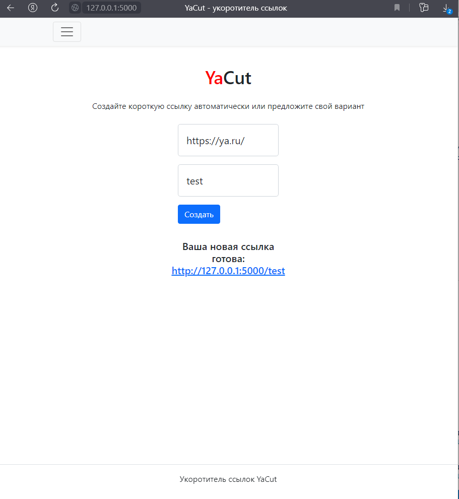
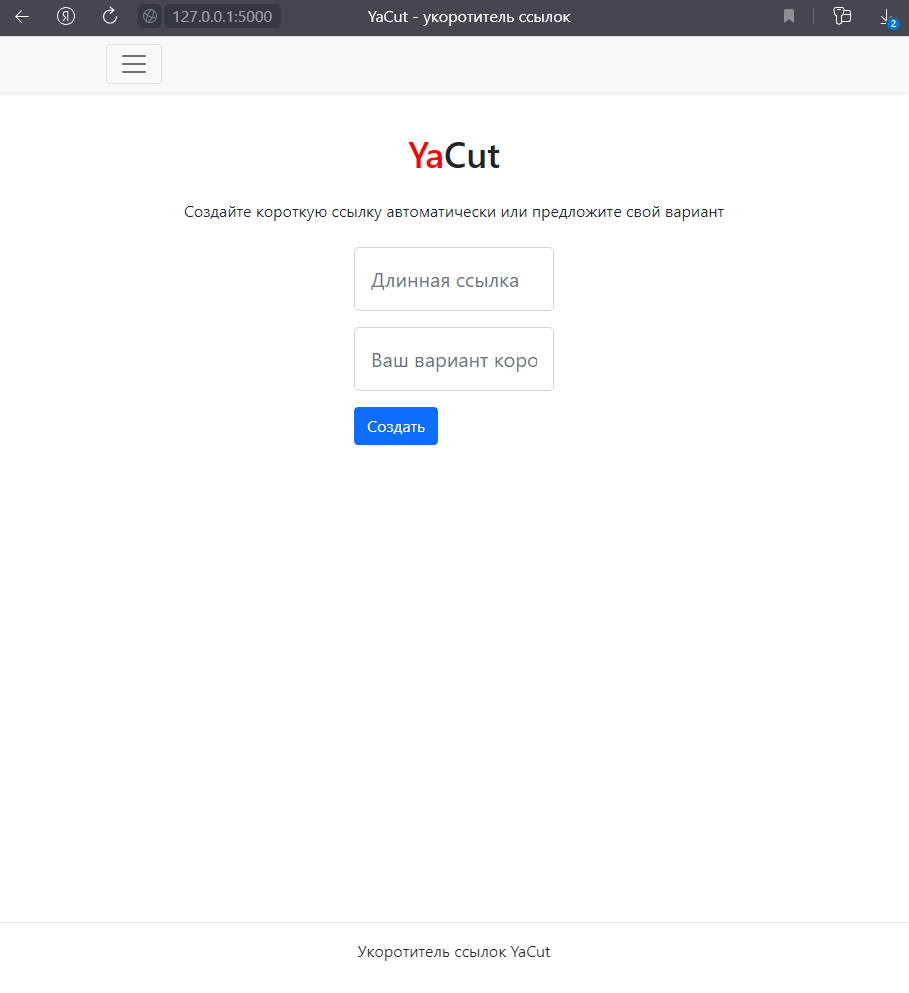
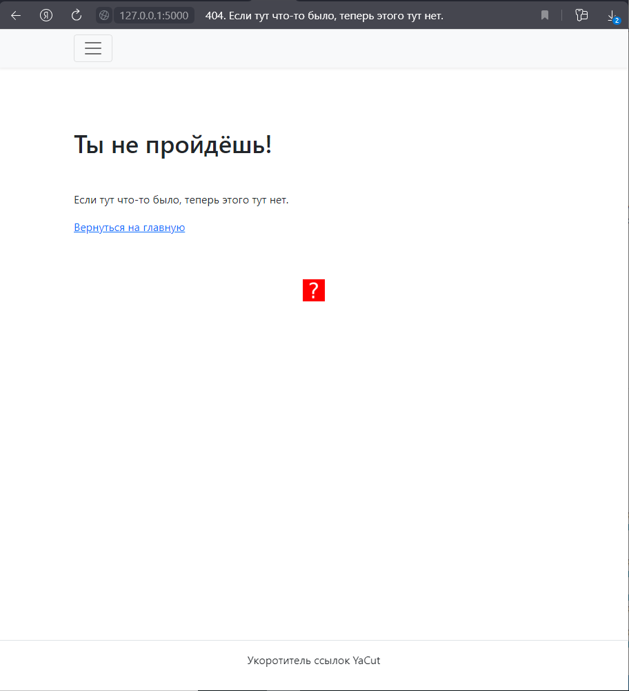
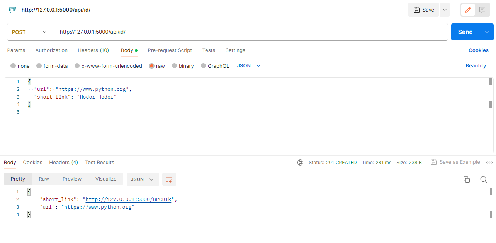
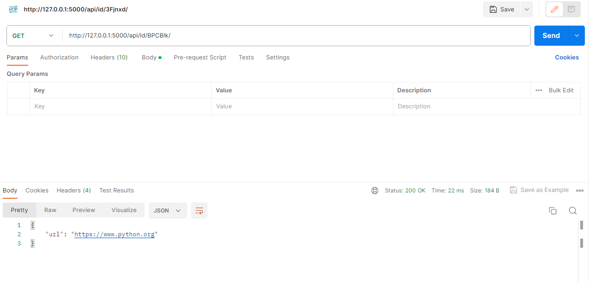
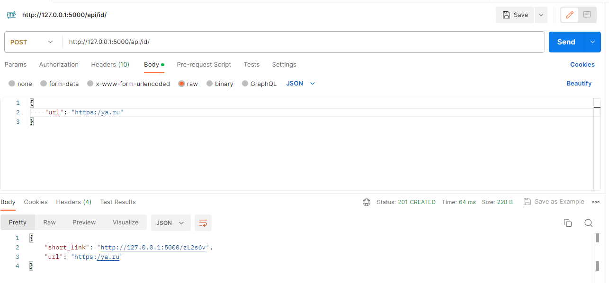

# yacut

### Описание проекта:

Проект YaCut — это сервис укорачивания ссылок. Его назначение — ассоциировать длинную пользовательскую ссылку с короткой, которую предлагает сам пользователь или предоставляет сервис.


### Как запустить проект:

Клонировать репозиторий и перейти в yacut в командной строке:
```
git clone https://github.com/mixer-sys/yacut.git
cd yacut/
```

Установить зависимости
```
python3 -m venv venv
source venv/Scripts/activate
pip3 install -r requirements.txt
```

Cоздать файл .env, пример .env.example
```
FLASK_APP=yacut
FLASK_ENV=development
DATABASE_URI=sqlite:///db.sqlite3
SECRET_KEY=$_SECRET_KEY$
```

Запустить
```
flask run
```

### Возможности проекта:
По готовой ссылке можно перейти







### Описание API

Содержится в файле openapi.yml

Можно открыть по ссылке https://editor.swagger.io/

Примеры:






